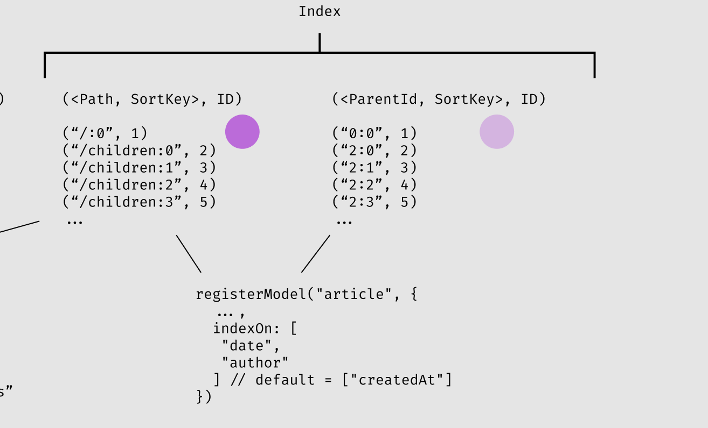
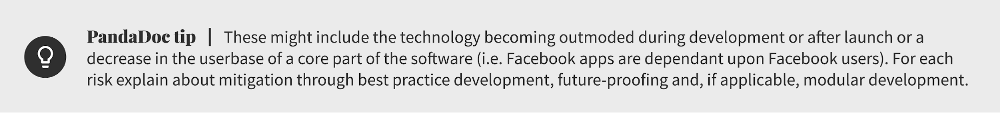

# OakDB

### Whitepaper


### BY

Dr. Thomas Weustenfeld

<p style="text-align: right">JAN 29, 2022</p>

# Why another database?

OakDB is a real-time tree structured high performance database for the next generation of collaborative applications. Its core features are:

- JSON tree data model
- In-memory, persisted log
- Schema free, but support for schema validation
- Real-time subscriptions
- Streaming architecture with full access to Oplog
- Authentication via Plugins
- Custom materialized view and indices
- Binary Websocket-based JSON protocol
- Undo-Redo stack
- Written in Rust

OakDB is inspired by Firebase Realtime DB, DynamoDB, Riak, Redis, Cassandra and Figma.

# TODO: Whitepaper

- Introduction (including “Problem Statement”)
- Background (research-heavy)
- Proposed solution
- Conclusion
- References or citations

# Overview Tree Data Model

All data in OakDB is modeled as a JSON-compatible tree. Besides basic CRUD operations, OakDB supports transactional move operations, ordered lists, undo-redo, and basic queries. For more complex queries OakDB is easily extensible through its streaming architecture.

Out of the box OakDB supports equality queries (==), range queries on any data type based on lexicographical order (&lt;, &lt;=, >, >=) on keys, values and nested values. Additionally, OakDB supports limiting and offsetting within an ordered set.

This is similar to Firebase Realtime DBs querying features:


OaksDBs primary data persistence layer is a distributed hyperlog/hypercore based append-only log data structure called “OpLog”. It’s primary index is an in-memory key-value store materialized through an append-only log.


The append-only log uses CRDT principles to achieve the following guarantees using a (dotted) vector clock:

- Total ordering of messages
- Free of duplicates
- Replication

See: [https://github.com/orbitdb/ipfs-log](https://github.com/orbitdb/ipfs-log)

Uncompressed example of the append-only log :

```
[
 { "op": "delete", "path": "/baz/d670460" },
 { "op": "set",    "path": "/baz/d670460/text", "value": "boo" },
]
```

OakDBs primary data engine is an embedded in-memory key-value store based on a log-structured merge-tree.


Keys are lexicographically sorted tuples of path, sortkey and property joined with colons represented as unicode U+F8FE. Values are arbitrarily-sized byte streams.

Based on the log, OakDB materializes three indices: A path based representation, a field based representation and a relationship based representation:

**Path based representation:**

```
(<Path>:[<SortKey>:]<Property>, Value)

("/:_type", "collection")
("/:name", "root")
("/children:0:_id", 2)
("/children:1:_id", 3)
("/children:2:_id", 4)
("/children:3:_id", 5)
("/test:3:_id", "abc")
...
```

For example

```
{ db: "oak", prop: { foo: "bar" }, arr: ["A","B"] }
```

Is represented as

```
("/db", "oak")
("/prop/foo", "bar")
("/arr/0", "A")
("/arr/1", "B")
```

&lt;SortKey> is optional and defined by the user for each path. Its intended use case is embedding an index without the need to create a secondary index. For example if a common operation is fetching the latest 10 items from a list of events, the &lt;SortKey> can be defined as the creation time, which allows for efficient queries

```
{ op: "setSortKey", path: "/articles", key: "createdAt" }
```

This is equivalent to:

```
/articles/2022-01-22-11-59-d670460/prop
/articles/<date>-<time>-<uuid>/prop
```

**Field based representation (Secondary Index):**

A secondary index can be created with

```
{ op: "setIndex", path: "/articles", key: ["createdAt"],
  unique: false,
  reverse: false } // Example: Lookup "*@gmail.com"
```

Which creates a entry in the secondary table of the following shape

```
("<path>/<indexKey>", <id>)

("/articles/2022-01-22-11-59", 4)
("/articles/2022-01-23-05-36", 3)
("/articles/2022-01-22-03-32", 6)

("/articles/thomas", 6)
("/articles/thomas", 1)
("/articles/thomas", 57)
("/articles/thomas", 23)
```

All secondary indices are stored in a single table. Ids are used because “4” would always refer to “/articles/4” and therefore storing “/articles/” is not necessary.

SortKey vs IndexKey (Secondary Index): Sort keys are more space efficient as they don’t require a secondary table, but have one downside: they can not change after the object creation.

Note, that both sortKeys and indexKeys can be combined keys. For example <code>&lt;<strong>indexKey</strong>> = &lt;<strong>type</strong>>-&lt;<strong>author</strong>>-&lt;<strong>datetime</strong>></code> would allow for an efficient query: <code>findAll([ "collection", "thomas", "2019*" ])</code> which would return all collections created by “thomas” in 2019.

**Relationship based representation:**

A special type of secondary index is a relationship index, which has the following structure:

```
("<path>/<indexKey>", <path-to-object>)

("/articles/5", "/author/5")
("/articles/5", "/author/5")
("/articles/3", "/author/5")
```

Usually &lt;indexKey> is the object id. It allows for time efficient lookups and joins on the special &lt;ref> field.

The relationship representation could be stored in a separate third table to leverage more efficient data structures. All relationships however are stored in a single table. Initially the index will use the log-structured key-value store, future implementations might use a hash table or **B+ tree** to improve search time.

The following diagram describes the architecture. Indices and the primary KV store use a subscriber model that consumes messages from the append-only log. The append log exposes a public API interface so it is easy to connect other consumers to the log, which could extend the core functionality of OakDB with for example specialized indices, like geo coordinates / R-tree, or caches, or added functionality like a dependency trackers (a table that keeps track of dependencies between nodes to perform computation on the dependent object).



## Transactional move

&lt;Explain transactional moves here>


##

## Fractional Indexing

&lt;Explain fractional indexing here>


\

## Undo-redo stack

&lt;Explain undo-redo stack here>


# Real-time Subscriptions

&lt;describe Trie-based lookup here>


# Transport Protocol

&lt;Explain transport protocol>

# Client Library

&lt;Explain client library>

#

# Storage Engine

## Key-Value Store

The storage engine (or database engine) is a software component of a database management system responsible for storing, retrieving, and managing data in memory designed to capture a persistent, long-term memory of each node

OakDBs storage engine is a Key-Value store based on a[ log-structured merge-tree](https://en.wikipedia.org/wiki/Log-structured_merge-tree) (LSM tree) data structure. LSM trees are data structures with performance characteristics that make it attractive for providing indexed access to files with high insert volume, such as transactional log data.


LSM trees have the following characteristics:

<table>
  <tr>
   <td><strong>Algorithm</strong>
   </td>
   <td><strong>Average</strong>
   </td>
   <td><strong>Worst case</strong>
   </td>
  </tr>
  <tr>
   <td>Insert
   </td>
   <td>O(1)
   </td>
   <td>O(1)
   </td>
  </tr>
  <tr>
   <td>Find-min
   </td>
   <td>O(N)
   </td>
   <td>O(N)
   </td>
  </tr>
  <tr>
   <td>Delete-min
   </td>
   <td>O(N)
   </td>
   <td>O(N)
   </td>
  </tr>
</table>

OakDB could be build on top of RocksDB, which supports:

- [Transactions[16]](https://en.wikipedia.org/wiki/Database_transaction)
- [Backups[17]](https://en.wikipedia.org/wiki/Backup) and[ snapshots[18]](<https://en.wikipedia.org/wiki/Snapshot_(computer_storage)>)
- [Column families[19]](https://en.wikipedia.org/wiki/Column_family)
- [Bloom filters[20]](https://en.wikipedia.org/wiki/Bloom_filter)
- Time to live (TTL) support<sup><a href="https://en.wikipedia.org/wiki/RocksDB#cite_note-21">[21]</a></sup>
- Universal compaction<sup><a href="https://en.wikipedia.org/wiki/RocksDB#cite_note-22">[22]</a></sup>
- Merge operators<sup><a href="https://en.wikipedia.org/wiki/RocksDB#cite_note-23">[23]</a></sup>
- Statistics collection<sup><a href="https://en.wikipedia.org/wiki/RocksDB#cite_note-24">[24]</a></sup>
- Geospatial indexing<sup><a href="https://en.wikipedia.org/wiki/RocksDB#cite_note-25">[25]</a></sup>

RocksDB is also widely used as the backend of numerous database systems, such as Cassandra, MySQL, MongoDB. An alternative could be [FASTER](https://dl.acm.org/doi/abs/10.14778/3229863.3236227) or our own implementation.

> In principle the database storage can be viewed as a[ linear address space](https://en.wikipedia.org/wiki/Linear_address_space), where every bit of data has its unique address in this address space. In practice, only a very small percentage of addresses are kept as initial reference points (which also requires storage); most data is accessed by indirection using displacement calculations (distance in bits from the reference points) and data structures which define access paths (using pointers) to all needed data in an effective manner, optimized for the needed data access operations.

##

## Append-only OpLog

&lt;Explain append only log here>

- Bloom filters
- HyperLogLog

#

# OakDB as a Distributed System

OakDBs strategies are similar to DynamoDB:

<table>
  <tr>
   <td>
<h3>Problem</h3>

   </td>
   <td>
<h3>Technique</h3>

   </td>
   <td>
<h3>Advantage</h3>

   </td>
  </tr>
  <tr>
   <td>Dataset partitioning
   </td>
   <td><a href="https://en.wikipedia.org/wiki/Consistent_hashing">Consistent Hashing</a>
   </td>
   <td>Incremental, possibly linear scalability in proportion to the number of collaborating nodes.
   </td>
  </tr>
  <tr>
   <td>Highly available writes
   </td>
   <td><a href="https://en.wikipedia.org/wiki/Vector_clocks">Vector Clock</a> or<a href="https://en.wikipedia.org/w/index.php?title=Dotted-Version-Vector_Sets&action=edit&redlink=1"> Dotted-Version-Vector Sets</a>, reconciliation during reads
   </td>
   <td>Version size is decoupled from update rates.
   </td>
  </tr>
  <tr>
   <td><del>Handling temporary failures</del>
   </td>
   <td><del><a href="https://en.wikipedia.org/w/index.php?title=Sloppy_quorums&action=edit&redlink=1">Sloppy Quorum</a> and<a href="https://en.wikipedia.org/w/index.php?title=Hinted_handoff&action=edit&redlink=1"> Hinted Handoff</a></del>
   </td>
   <td><del>Provides high availability and durability guarantee when some of the replicas are not available.</del>
   </td>
  </tr>
  <tr>
   <td>Handling temporary failure
   </td>
   <td>Bitmap Version Vectors
   </td>
   <td>
   </td>
  </tr>
  <tr>
   <td>Recovering from permanent failures
   </td>
   <td>Anti-entropy using<a href="https://en.wikipedia.org/wiki/Merkle_trees"> Merkle tree</a>
   </td>
   <td>Can be used to identify differences between replica owners and synchronize divergent replicas pro-actively.
   </td>
  </tr>
  <tr>
   <td>Membership and failure detection
   </td>
   <td><a href="https://en.wikipedia.org/wiki/Gossip_protocol">Gossip-based membership protocol</a> and failure detection
   </td>
   <td>Avoids having a centralized registry for storing membership and node liveness information, preserving symmetry.
   </td>
  </tr>
</table>

## PACELC Tradeoffs

The PACELC theorem states: In case of a paration (P) one has to choose between availability (A) and consistency (C) (as per the CAP theorem), but else (E), even when the system is running normally in the absence of partitions, one has to choose between latency (L) and consistency (C).

OakDB is designed as a PA/EL system, meaning if a partition occurs, OakDB gives up consistency for availability, and under normal operation gives up consistency for lower latency.

# Fault-tolerance, consensus and leader election

OakDB uses the Raft Consensus Algorithm: Raft is a consensus algorithm that is designed to be easy to understand. It's equivalent to Paxos in fault-tolerance and performance. The difference is that it's decomposed into relatively independent subproblems, and it cleanly addresses all major pieces needed for practical systems. Raft is also used for reasons of availability of an abundance of existing implementations, see https://raft.github.io/.

**Failure recovery**

OakDB uses Anti-Entropy based on Merkle trees to recover from permanent failure.

Hash trees like Merkle trees can be used to verify any kind of data stored between nodes. To demonstrate that a leaf node is a part of a given binary hash tree requires computing a number of hashes proportional to the logarithm of the number of leaf nodes in the tree.

OakDB uses Bitmap Version Vectors to recover from short term failure.


# Replication and Consistency

OakDB uses CRDT principles to achieve consistency.

-

#

# Other considerations and open questions

Question: Why not just a relational db then?

Describe: How OakDB optimizes for different read and write operations:

Think about: Separate assets from trees?

Think about: Normalization vs denormalization

Find YouTube Video on Nifty? (Raft)

Other considerations:

- Distributed as Unikernel
- Lenses?
- Can run in an untrusted environment?
- Search? (node specialization)
- Auto-Indices
- ACID: [atomicity](<https://en.wikipedia.org/wiki/Atomicity_(database_systems)>),[ consistency](<https://en.wikipedia.org/wiki/Consistency_(database_systems)>),[ isolation](<https://en.wikipedia.org/wiki/Isolation_(database_systems)>), and[ durability](<https://en.wikipedia.org/wiki/Durability_(database_systems)>)
- Remote access (dumps, backups)

## OakDB vs Firebase

<table>
  <tr>
   <td>
   </td>
   <td><strong>OakDB</strong>
   </td>
   <td><strong>Firebase</strong>
   </td>
  </tr>
  <tr>
   <td>Array-contain query
   </td>
   <td>YES
   </td>
   <td>NO
   </td>
  </tr>
  <tr>
   <td>Joins
   </td>
   <td>YES
   </td>
   <td>NO
   </td>
  </tr>
  <tr>
   <td>Key compaction
   </td>
   <td>YES
   </td>
   <td>NO
   </td>
  </tr>
</table>

## Alternative Names:

PineDB

CherryDB

#

#

    Ignore:


    [Any industry or market-related risks]



