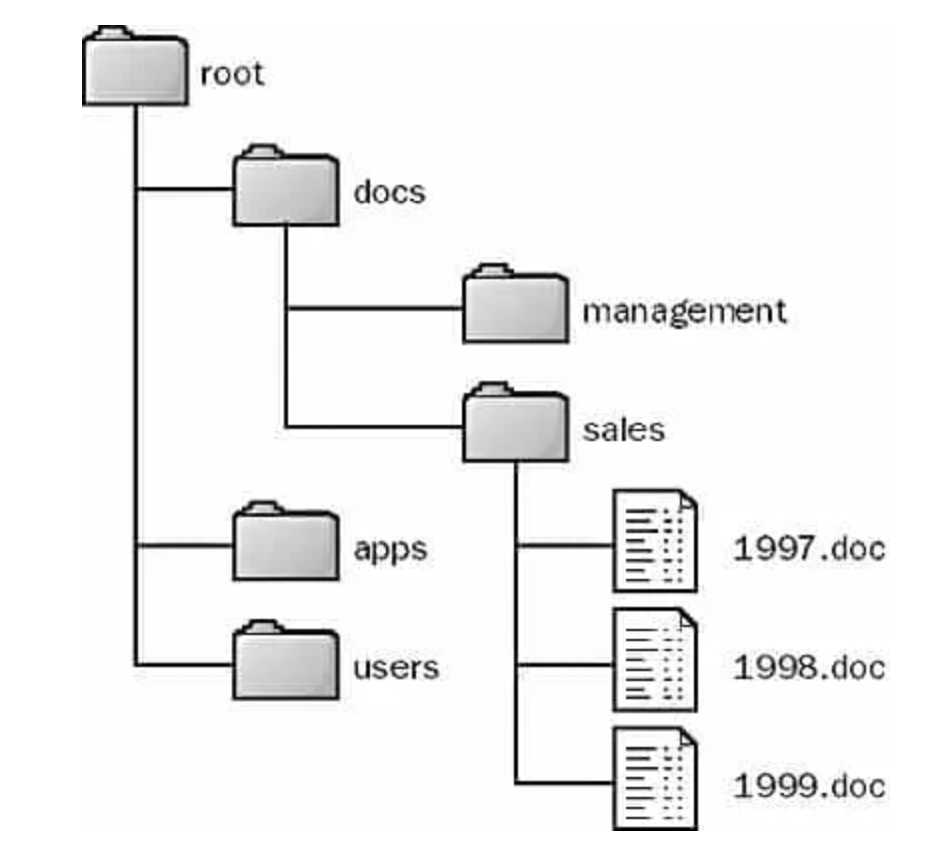

# Mental Model

OakDB is a NoSQL document oriented database which organizes documents in a tree.
Think of it as a tree of documents similar to a file system, where each file is a key-value store.



Similar to a file system, a file and folder with the same name can not exist at the same location in OakDB. All of the data in OakDB can be represented as JSON, but not all of JSON can be represented in OakDBs data model.

For example, the following JSON is not valid in OakDB:

```js
{
  a: 1,
  b: {
    documentName: "hello"
  }
}
```

and needs to be restructed to:

```js
{
  root: {
    a: 1,
  },
  b: {
    sub: {
      documentName: "hello"
    }
  }
}
```

equivalent to:

```bash
mkdir b
cat "{ a: 1 }" > root
cat "{ documentName: 'hello' }" > b/sub
```

OakDB does not require you to "create a folder". Paths are automatically created as needed.

While technically the data structure above could be represented as:

```bash
mkdir b
cat '"1"' > a
cat '"hello"' > b/documentName
```

OakDB requires each document to be representable as a key-value map, which wouldn't be the case if document contain a single value.

Also, this only applies to the entire data structure. Within a document node, all JSON is valid. So wrapping the entire document into a single root node would work:

```js
{
  root: {
    a: 1,
    b: {
      documentName: "hello"
    }
  }
}
```

```bash
cat "{ a: 1, b: { documentName: 'hello' } }" > root
```

While this might seem like a limitation, you'll see that most data will map very nicely to this data structure.

# OakDB Data Model

OakDB supports two different ways to represent data. The first is a simple key-value data model. The second is a tree-like data model. Combined all data in OakDB can be modeled as a ~JSON-compatible~ tree.

Every document in OakDB is a tree of objects, similar to the HTML DOM. There is a single root object that represents the entire document. Underneath the root object are page objects, and underneath each page object is a hierarchy of objects representing the contents of the page. This tree is is presented in the layers panel on the left-hand side of the Figma editor.

Each object has an ID and a collection of properties with values. One way to think about this is by picturing the document as a two-level map: `Map<ObjectID, Map<Property, Value>>`. Another way to think about this is a database with rows that store (ObjectID, Property, Value) tuples.

For example the following JSON document:

```json
{
  "book": {
    "444": {
      "language": "C",
      "edition": "First",
      "author": "Dennis Ritchie"
    },
    "555": {
      "language": "C++",
      "edition": "Second",
      "author": "Bjarne Stroustrup"
    }
  }
}
```

will be represented as (OPV-Map):

```
((444, language), "C")
((444, edition), "First")
((444, author), "Dennis Ritchie")
((555, language), "C++")
((555, edition), "Second")
((555, author), "Bjarne Stroustrup")
```

Additionally OakDB is tracking all objects in a bijective map (BiMap):

```
(`/book/`, 444)
(`/book/`, 555)
```

```
(444, `/book/`)
(555, `/book/`)
```

Every time a change is made, that change needs to be applied to both the Object-Property-Value map (OPVMap) and the bijective map (BiMap). Object IDs are globally unqiue 120 bit hashes. See `poc-pushid`.

## Limitations

There are some limitations to this approach. For example it can not represent all possible json data. For example, single value objects can not be represented.

```
{
  "book": {
    "444": "hello",
    "555": "world"
  }
}
```

Not all objects have to be uuid-to-object-maps. A string-to-any-map is possible, it just doesn't support all queries.

## ???

```
{ op: "set", id: 444, prop: 'language', value: 'Rust' }
{ op: "set", path: '/books/444/language', value: 'Rust' }
```

# FAQ

### How do I store meta-data about a folder?

If you want to store meta-data about a folder, the convetion is to create a document with the following naming convetion `<folder name>/.meta`. Example:

```json
{
  "book": {
    ".meta": {
      "createdAt": 15918273098
    },
    "555": {
      "language": "C++",
      "edition": "Second",
      "author": "Bjarne Stroustrup"
    }
  }
}
```

OakDB will ignore the `.meta` document, when running queries on `/book`.

### Since OakDB uses a data-model similar to a file-sytem, can I export the data to a file-system?

Yes, just run `oakdb export --out <path>` and the data will be exported to the file-system. Paths will be mapped to folders and documents to `.json` files.
If you want to create a single file you can run `oakdb export --out <path> --archive` insted, which will create a single large JSON dump.

### Why this data model?

- Filesystems
- CMS
- Figma
- DOM / XML

### Why not have a `children` field?

### Nested documents

/type/<uuid>/subtype/<uuid>
