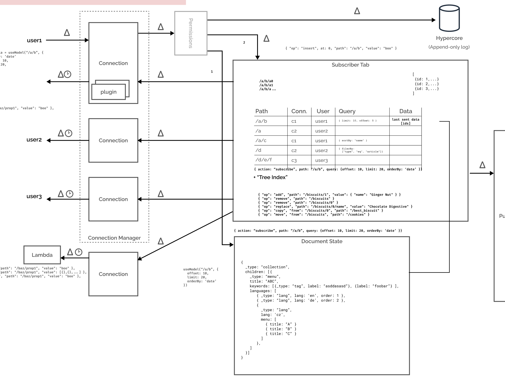

- Figma: Figmas (LiveGraph)[https://www.figma.com/blog/under-the-hood-of-figmas-infrastructure/#livegraph]
  > LiveGraph obviates the need for that by detecting relevant changes in the underlying database, filtering updates based on client’s access permissions and pushing relevant updates to the client in real-time. In other words, it allows a client to subscribe to a query and receive push notifications whenever the results of the query change.

