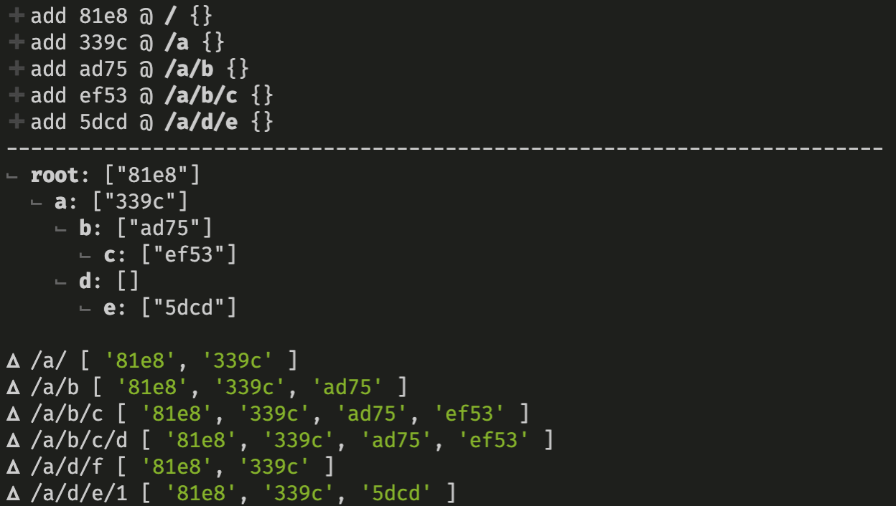

# PoC: Real-time Subscription Table

This is a proof of concept for a real-time subscription table based on a Trie-like data structure. The goal is to effieciently support the following use cases:

- Match subscribers that are affected by a given change in `O(n)` time, where `n` is the number of path segments.
- Add subscribers at a given path segment
- Remove subscribers at a given path segment

| Description        | Class Method                              |
| ------------------ | ----------------------------------------- |
| Match subscribers  | `match(path, queryOptions)`               |
| Add subscribers    | `add(connection, path, queryOptions)`     |
| Remove subscribers | `remove(connection, path, queryOptions) ` |

## Data Structure

The data structure represents each path segement as a node in a graph. Each node has a list of connections to other nodes and each node stores information about the subscribers that are interested in updates at or below that node.

For example the leaf node for the [linear](https://en.wikipedia.org/wiki/Path_graph) tree described by `/x/y/a` with 2 subscribers `s1` and `s2` is:

```js
class PathGraphNode {
  edges = {
    a: new PathGraphNode(),
  };
  subscribers = {
    [s1]: queryOptions1,
    [s2]: queryOptions2,
  };
}
```

# Example

```js
subtab.add(uuid(), `/`, {});
subtab.add(uuid(), `/a`, {});
subtab.add(uuid(), `/a/b`, {});
subtab.add(uuid(), `/a/b/c`, {});
subtab.add(uuid(), `/a/d/e`, {});

subtab.match("/a/");
subtab.match("/a/b");
subtab.match("/a/b/c");
subtab.match("/a/b/c/d");
subtab.match("/a/d/f");
subtab.match("/a/d/e/1");
```

Run `node -r esm playground` to see the output:

**Output:**



## Run tests:

```bash
../node_modules/.bin/jest
```
